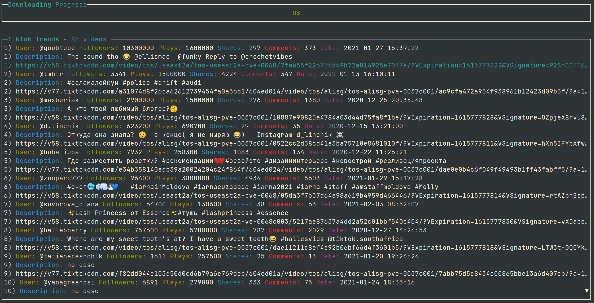

# tiktik 📱🥴 - TikTok Terminal Client
> Name inspiration - <a href="https://www.youtube.com/watch?v=h1M8oY0Uvi4">this yt vid</a>
<p align="center"></p>

Huge Thanks to <a href="https://github.com/Hedgehogues">Egor</a> who wrote parsing part

# Keybinds ⌨️
| UI       | Keybind              | Description                      |
|----------|----------------------|----------------------------------|
| Common   | `j` / `down arrow`     | Move down by one row.            |
| Common   | `k` / `up arrow`       | Move up by one row.              |
| Common   | `g` / `home`           | Move to the top.                 |
| Common   | `G` / `end`            | Move to the bottom.              |
| Common   | `Ctrl-F` / `page down` | Move down by one page.           |
| Common   | `Ctrl-B` / `page up`   | Move up by one page.             |
| Common   | `r` / `Ctrl-R` | Refresh tiktoks.           |
| Link selected   | `e` / `enter` | Open TikTok with Browser.    |
| Link selected   | `d` / `Ctrl-D` | Download TikTok.    |

# Contributing 🤝
Contributions, issues and feature requests are welcome! 👍 <br>
Feel free to check [open issues](https://github.com/irevenko/tiktik/issues).

# Quick Start 🚀
```git clone https://github.com/irevenko/tiktik.git``` <br>
```cd tiktik``` <br>
```go get -d ./...``` <br>
```go build``` <br>

# What I Learned 🧠
- cookies, headers

# ToDo
- [ ] Search by user, hashtags
- [ ] Keybind for tiktoks number (current default num is ~90-100 vids)
- [ ] Fancy UI (colors)

# License 📑 
(c) 2021 Ilya Revenko. [MIT License](https://tldrlegal.com/license/mit-license)
